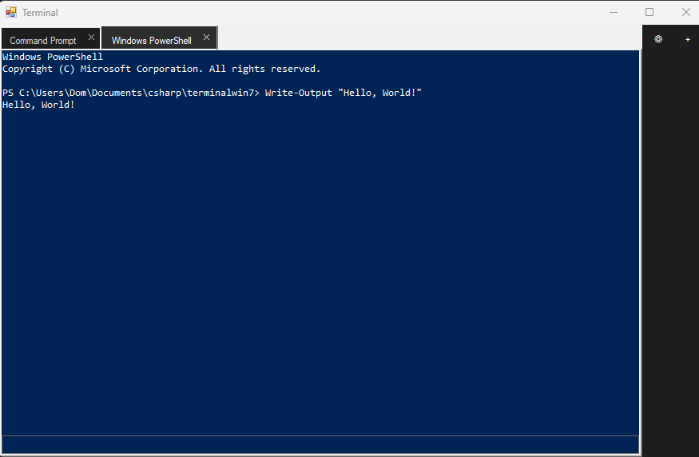

# AeroTerminal
A lightweight Terminal for Windows XP or above.

## How to compile
1. Install `csc` on your computer
2. Add `csc` to your PATH
3. Download all scripts in `src`
4. Inside `src`, run `csc /target:winexe /platform:x86 /out:AeroTerminal.exe Program.cs MainForm.cs TerminalControl.cs SettingsForm.cs Metadata.cs`
 
If everything went correctly, you should now have a EXE next to all scripts.  
## How to run
### Windows 7+
1. Compile AeroTerminal
2. Run `AeroTerminal.exe`
### Windows XP/Vista
1. Install .NET Framework 2.0 or newer
2. Install PowerShell 1.0 or newer
3. Compile AeroTerminal
4. Run `AeroTerminal.exe`
